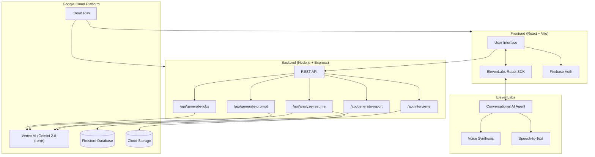
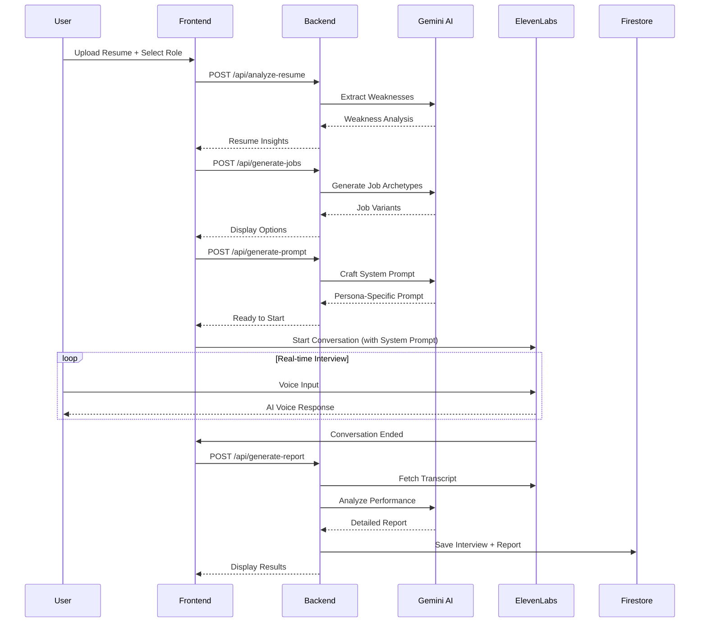

# Sparr AI — Survive The Interview

> **Train with the AI interviewer that challenges you, probes your weaknesses, and prepares you for reality.**


---

## Demo Video

[](https://youtube.com/your-demo-link)

> *3-minute walkthrough showing the full interview experience*

---

## Live Demo

**[Try Sparr AI Live →](https://sparr-frontend-430715776322.us-central1.run.app) https://sparr-frontend-430715776322.us-central1.run.app**

> *Note: Requires microphone access for voice interviews*

---

## Challenge

**ElevenLabs Challenge** — *AI Partner Catalyst Hackathon (Google Cloud x ElevenLabs)*

> "Use ElevenLabs and Google Cloud AI to make your app conversational, intelligent, and voice-driven."

---

## What is Sparr AI?

**Sparr AI** is a hyper-realistic mock interview platform that turns interview prep into a full-contact sport.

### The Problem
Traditional interview prep tools are polite, scripted, and predictable. Real interviews are not. Candidates walk into high-stakes situations unprepared for:
- **Pressure** — The stress of being evaluated in real-time
- **Follow-up questions** — Interviewers probe deeper when answers are weak
- **Tough personas** — Not every interviewer is friendly; some are skeptical, impatient, or cold

### Our Solution
Unlike passive interview simulators, Sparr AI combines two powerful technologies:
- **ElevenLabs Conversational AI** — Sub-second voice latency creates natural, flowing conversations
- **Google Vertex AI (Gemini 2.5 Flash)** — Intelligent reasoning powers dynamic question generation

The result? Interviews that feel *real*, challenge you *meaningfully*, and help you *actually improve*.

---

## What Makes Sparr AI Different?

### Session Spaces — Continue Where You Left Off

**This is our most unique feature.** Unlike other interview prep tools where each session is isolated, Sparr AI implements a **linked interview chain** system:

- **Context Preservation** — When you start a follow-up session, the AI remembers your previous performance, weak points, and areas that need improvement
- **Progressive Difficulty** — Each subsequent interview builds on the last, pushing you harder on areas you struggled with
- **Improvement Tracking** — See your growth across multiple sessions, not just one-off snapshots
- **Linked List Architecture** — Sessions are stored with `parentId` and `childId` references in Firestore, creating a traversable chain

**How it works:**
1. Complete an interview → Get a detailed report with identified weaknesses
2. Click "Continue Interview" → New session inherits context from previous report
3. AI crafts a new system prompt that specifically targets areas for improvement
4. Repeat until you've mastered the skills needed

### 🎭 5 Distinct Interviewer Personas

Not just different names — each persona has a completely different **interview philosophy**, **questioning style**, and **evaluation criteria**:

| Persona | Role | What They Test | Voice |
|---------|------|----------------|-------|
| **Michael** | The "Vibe Check" Peer | Cultural fit, communication style, how you'd be to work with | Casual, friendly |
| **Kelsey** | The Behavioral HR | Soft skills, conflict resolution, "Tell me about a time..." | Warm but probing |
| **Ellen** | The Algo Purist | Technical depth, Big-O notation, system design fundamentals | Cold, logical, speaks 10+ languages |
| **James** | The Skeptic Senior | BS detection, challenging assumptions, "Why not just..." | Direct, skeptical |
| **Mark** | The Startup Hustler | Pragmatism, ability to ship code, "What would you build..." | Impatient, energetic |

Each persona uses a **different ElevenLabs voice** and receives a **customized system prompt** generated by Gemini based on their personality traits.

### Resume-Aware Probing

Your **actual weaknesses** drive the interview, not generic questions:

1. **PDF Parsing** — Upload your resume, and we extract the text using `pdf-parse`
2. **Gemini Analysis** — Vertex AI identifies gaps, inconsistencies, and areas to probe
3. **Dynamic Questions** — The interviewer specifically asks about projects you've worked on, technologies you've listed, and experience gaps you have
4. **Personalized Feedback** — Your post-interview report addresses *your* specific areas for improvement

### 10+ Languages with Real-Time Voice

Ellen speaks **10 languages** natively, powered by ElevenLabs multilingual synthesis:
- English, Spanish, Russian, Romanian, Slovak, Croatian, Italian, German, Polish, Danish

The language is detected dynamically and enforced in the system prompt so the interviewer maintains consistency.

---

## Key Features

| Feature | Description |
|---------|-------------|
| **Session Spaces** | Continue interviews with full context from previous sessions — progressive improvement |
| **5 Interviewer Personas** | Each with unique voice, personality, and questioning style |
| **Resume-Aware Probing** | AI targets YOUR specific weaknesses, not generic questions |
| **10+ Languages** | Ellen conducts full interviews in multiple languages |
| **Detailed Reports** | Timestamped feedback, score breakdowns, specific improvement areas |
| **Company-Specific Archetypes** | Job descriptions generated for Google, Amazon, Meta, custom companies |
| **Immersive Mode** | Full-screen interview experience with audio visualization |
| **Workbook Notes** | Take notes during the interview that persist to your report |

---

## Screenshots

> **Note:** Add your screenshots to `screenshots/` directory before final submission

| Landing Page | Session Wizard | Interview |
|--------------|----------------|-----------|
|  |  |  |

| Workflow Builder | Report View | Spaces Chain |
|------------------|-------------|--------------|
|  |  |  |

---

## Technology Stack — How It Works

### Google Cloud (Vertex AI + Firebase)

We use **Gemini 2.5 Flash** via Vertex AI for all intelligent reasoning tasks. Here's exactly HOW:

#### 1. Job Archetype Generation (`/api/generate-jobs`)
```
Input: Company name, role, experience level
Process: Gemini generates 3-4 realistic job description variants
Output: Array of job archetypes with responsibilities, requirements, and focus areas
```
**Why this matters:** Different companies want different things. A "Senior Software Engineer" at Google vs. a startup has completely different expectations. We generate realistic archetypes so the interview targets the RIGHT skills.

#### 2. Resume Analysis (`/api/analyze-resume`)
```
Input: Resume PDF + target job context
Process: pdf-parse extracts text → Gemini identifies weaknesses and gaps
Output: Structured weakness analysis + storage URL for resume file
```
**Why this matters:** Generic interview questions waste time. By analyzing YOUR resume, we probe YOUR specific gaps.

#### 3. System Prompt Crafting (`/api/generate-system-prompt`)
```
Input: Persona + job archetype + resume weaknesses + previous session feedback
Process: Gemini creates a multi-paragraph interviewer persona prompt
Output: Dynamic system prompt that instructs the ElevenLabs agent exactly how to behave
```
**Why this matters:** This is the "brain" of the interviewer. Ellen the HR person asks different questions than James the skeptical senior engineer — because their prompts are completely different.

#### 4. Post-Interview Report (`/api/generate-report`)
```
Input: Full conversation transcript + job context + persona
Process: Gemini analyzes responses, creates timestamped feedback, scores performance
Output: Detailed report with scores, strengths, weaknesses, and specific improvement areas
```
**Why this matters:** You get actionable feedback, not just "you did okay."

#### Firebase Integration
- **Auth** — Anonymous guest mode + Google Sign-In for persistent accounts
- **Firestore** — All interviews stored with linked-list structure (parentId/childId for Spaces)
- **Storage** — Resumes uploaded securely to Cloud Storage with signed URLs

---

### ElevenLabs (Conversational AI)

The **ElevenLabs React SDK** (`@elevenlabs/react`) powers our voice experience:

**Key Overrides We Use:**
- `prompt` — Inject our Gemini-generated system prompt
- `firstMessage` — Each persona greets differently based on context
- `voiceId` — 5 different voices for 5 different personas
- `language` — Ellen can interview in 10 languages

#### Voice IDs (from `personas.js`)
| Persona | Voice ID |
|---------|----------|
| Michael | `ljX1ZrXuDIIRVcmiVSyR` |
| Kelsey | `YY7fzZmDizFQQv8XPAIY` |
| Ellen | `BIvP0GN1cAtSRTxNHnWS` |
| James | `KiAVAr8isNbPP0s3etPX` |
| Mark | `86SOy9VyOePcRbIneYDa` |

---

### Frontend Stack
- **React (Vite)** — Fast development, instant HMR
- **Tailwind CSS** — Utility-first styling
- **Framer Motion** — Fluid animations for immersive experience
- **ReactFlow** — Visual workflow builder for session chains
- **Recharts** — Performance analytics visualization

### Backend Stack
- **Node.js (Express)** — RESTful API server
- **pdf-parse** — Extract text from uploaded resume PDFs
- **Firebase Admin SDK** — Secure server-side Firestore/Storage access
- **Google Cloud Vertex AI SDK** — Direct Gemini API calls

---

## 🏗 Architecture



### Data Flow



---

## Getting Started

### Prerequisites
- Node.js v18+
- npm or yarn
- Google Cloud Account
- ElevenLabs Account
- Firebase Account

---

## Service Configuration

### 1. Google Cloud Setup (Vertex AI)

1. **Create a Google Cloud Project**
   - Go to [Google Cloud Console](https://console.cloud.google.com)
   - Create a new project or select an existing one
   - Note your **Project ID** (displayed below the welcome message)

2. **Enable Required APIs**
   Navigate to **APIs & Services → Enable APIs** and enable:
   - Vertex AI API
   - Cloud Storage API

   

3. **Create a Service Account**
   - Go to **IAM & Admin → Service Accounts**
   - Click **+ Create Service Account**
   - Name it (e.g., `sparr-ai-backend`)
   - Grant roles: `Vertex AI User`, `Storage Object Admin`
   - Click **Done**

4. **Generate Service Account Key**
   - Click on your new service account
   - Go to **Keys → Add Key → Create new key**
   - Select **JSON** format
   - Download and save as `key.json` in the `backend/` directory

   

> **Important**: Don't commit this key file to version control

---

### 2. ElevenLabs Setup


1. **Create an Account**
   - Sign up at [elevenlabs.io](https://elevenlabs.io)

2. **Get Your API Key**
   - Go to **Developers → API Keys**
   - Click **Create Key**
   - Name it (e.g., `sparr ai`)
   - Give access to the necessary Endpoints
   - Click **Create Key** and copy your API key

   

3. **Add Required Voices to My Voices**
   
   Search for each voice by Voice ID and add them to "My Voices":
   
   | Persona | Voice Name | Voice ID |
   |---------|------------|----------|
   | Michael | — | `ljX1ZrXuDIIRVcmiVSyR` |
   | Kelsey | — | `YY7fzZmDizFQQv8XPAIY` |
   | Ellen | — | `BIvP0GN1cAtSRTxNHnWS` |
   | James | — | `KiAVAr8isNbPP0s3etPX` |
   | Mark | — | `86SOy9VyOePcRbIneYDa` |

   - Go to **Voices → Explore**
   - Search using the Voice ID
   - Click **Add to My Voices** for each

   
   
   

4. **Create a Conversational Agent**
   - Navigate to **Agents**
   - Click **New Agent**
   - Select **Blank Agent**
   - Name it (e.g., `Sparr AI`)
   - Configure the agent with:
     - **Model**: Select **Gemini 2.5 Flash Lite**
     - **First Message**: Leave blank (we override this dynamically)
     - Navigate to the **Tools** tab and toggle the **End Conversation** and **Detect Language** tools on
     - Navigate to the **Security** tab and toggle all options in the **Overrides** section on
     - Go the the **Advanced** tab, then head over to the **Conversational behavior** and set:
       - **Eagerness**: **Eager**
       - **Take turn after silence**: **7 seconds**
       - **End conversation after silence**: **20 seconds**
       - **Max conversation duration**: **300 seconds**
   - Publish the agent and copy the **Agent ID** at the top left of the page

   

5. **Add Voices to Agent**
   - In the agent settings, go to the **Agent** tab
   - On the right side, find the **Voices** section
   - Add all 5 voices you saved to "My Voices"

   

6. **Configure Languages**
   - In the **Language** section of the Agent tab
   - Add languages supported by each persona:
     - **English** (all personas)
     - **Spanish, Russian, Romanian, Slovak, Croatian, Italian, German, Polish, Danish** (Ellen only)

> **Tip**: The Agent ID looks like: `agent_xxxxxxxxxxxxxxxxxxxx`

---

### 3. Firebase Setup

1. **Create a Firebase Project**
   - Go to [Firebase Console](https://console.firebase.google.com)
   - Click **Create a project**
   - Name it (e.g., `sparr-ai`)
   - Enable Google Analytics (optional)

2. **Enable Authentication**
   - Go to **Build → Authentication → Sign-in method**
   - Enable **Email/Password**
   - Enable **Google** provider
   - Enable **Anonymous** (for guest access)

3. **Create Firestore Database**
   - Go to **Build → Firestore Database → Create database**
   - Start in **production mode**
   - Select a region (e.g., `us-central1`)
   
   

4. **Set Firestore Security Rules**
   - Go to **Build → Firestore Database → Rules**
   - Replace with:
   ```javascript
   rules_version = '2';
   service cloud.firestore {
     match /databases/{database}/documents {
         match /interviews/{interviewId} {
            allow read: if request.auth != null && resource.data.userId == request.auth.uid;
            allow create: if request.auth != null && request.resource.data.userId == request.auth.uid;
            allow update, delete: if request.auth != null && resource.data.userId == request.auth.uid;
         }
      }
   }
   ```

5. **Enable Cloud Storage**
   - Go to **Build → Storage → Get started**
   - Set security rules:
   - Simulation type: **get**
   ```javascript
   rules_version = '2';
   service firebase.storage {
      match /b/{bucket}/o {
         match /users/{userId}/{allPaths=**} {
            allow read: if request.auth != null && request.auth.uid == userId;
            allow write: if request.auth != null 
                        && request.auth.uid == userId
                        && request.resource.size < 10 * 1024 * 1024;
         }
         match /{allPaths=**} {
            allow read, write: if false;
         }
      }
   }
   ```

   

6. **Get Web App Config**
   - Go to **Project Settings → General → Your apps**
   - Click **Add app** → **Web** (</> icon)
   - Register the app
   - Copy the Firebase config values

7. **Generate Admin SDK Service Account**
   - Go to **Project Settings → Service accounts**
   - Click **Generate new private key**
   - Save as `serviceAccountKey.json` in `backend/`

   

---

## Installation

### 1. Clone the Repository
```bash
git clone https://github.com/excel-asaph/sparr-ai.git
cd sparr-ai
```

### 2. Backend Setup
```bash
cd backend
npm install
```

Create a `.env` file in `backend/`:
```env
PROJECT_ID=your-google-cloud-project-id
KEY_PATH=./key.json
ELEVENLABS_API_KEY=your_elevenlabs_api_key
```

Place your service account keys:
- `key.json` (Google Cloud service account)
- `serviceAccountKey.json` (Firebase Admin SDK)

Start the server:
```bash
node server.js
# ✅ Backend running on port 3000
```

### 3. Frontend Setup
```bash
cd frontend
npm install
```

Create a `.env` file in `frontend/`:
```env
VITE_FIREBASE_API_KEY=your_firebase_api_key
VITE_FIREBASE_AUTH_DOMAIN=your-project.firebaseapp.com
VITE_FIREBASE_PROJECT_ID=your-project-id
VITE_FIREBASE_STORAGE_BUCKET=your-project.appspot.com
VITE_FIREBASE_MESSAGING_SENDER_ID=your_sender_id
VITE_FIREBASE_APP_ID=your_app_id
VITE_ELEVENLABS_AGENT_ID=agent_xxxxxxxxxxxxx
VITE_API_URL=http://localhost:3000
```

Start the development server:
```bash
npm run dev
# ➜ Local: http://localhost:5173/
```

---

## Deployment (Google Cloud Run)

Both frontend and backend are deployed to Google Cloud Run:

| Service | URL |
|---------|-----|
| **Frontend** | https://sparr-frontend-430715776322.us-central1.run.app |
| **Backend** | https://sparr-api-430715776322.us-central1.run.app |

---

## Learnings & Challenges

### What We Learned

1. **ElevenLabs Conversational AI is powerful** — The sub-second latency makes voice interactions feel natural. The `firstMessage` override was key to creating personalized greetings.

2. **Gemini excels at context-aware generation** — From generating realistic job archetypes to crafting persona-specific system prompts, Gemini 2.0 Flash handled complex reasoning tasks efficiently.

3. **State synchronization is critical** — Managing interview state across Firebase, React, and ElevenLabs required careful design to ensure data integrity.

### Challenges Faced

1. **Audio-to-transcript timing** — Aligning feedback pins with audio playback required using actual audio duration rather than estimated values.

2. **Session continuity** — Implementing "Spaces" (linked interview sessions) required robust linked-list management in Firestore.

3. **Persona voice consistency** — Ensuring each persona maintained their character throughout the interview required detailed system prompts.

---

## Project Structure

```
sparr-ai/
├── backend/
│   ├── server.js          # Express API (Gemini + Firebase)
│   └── package.json
├── frontend/
│   ├── src/
│   │   ├── pages/         # LandingPage, DashboardPage, LoginPage
│   │   ├── components/    # VoiceOrb, SessionSetupWizard, ReportsTab
│   │   ├── contexts/      # AuthContext (Firebase)
│   │   └── data/          # Personas, Languages
│   └── package.json
├── LICENSE                # Apache License
└── README.md
```

---

## 👥 Team

| Name | Role |
|------|------|
| **Excel Asaph** | Frontend Developer & Product Designer |
| **Emmanuel Obolo** | Backend Developer |
| **Abiodun Kumuyi** | Backend Developer |

---

## License

This project is licensed under the Apache License 2.0 — see the [LICENSE](LICENSE) file for details.

---

<div align="center">

**Survive The Interview. Train with pressure. Perform under less.**

*Built using Google Cloud & ElevenLabs*

</div>