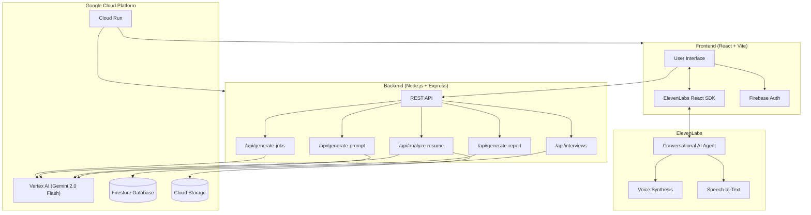
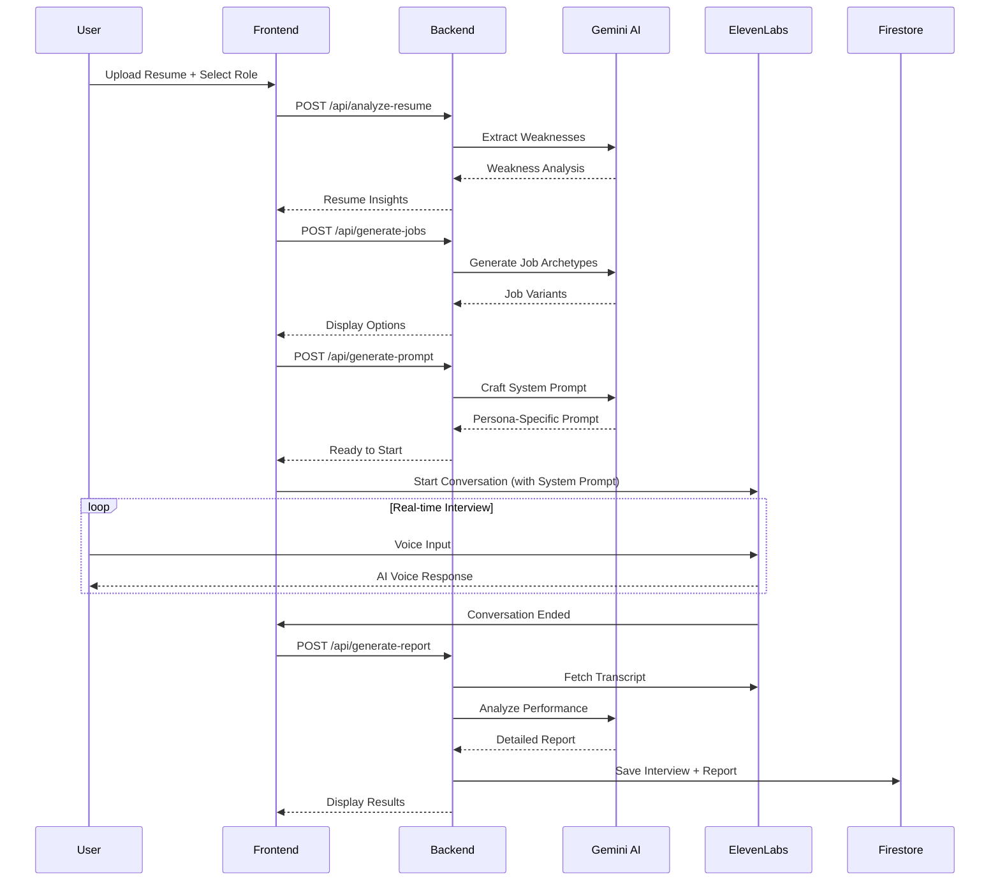

# Sparr AI — Survive The Interview

> **Train with the AI interviewer that challenges you, probes your weaknesses, and prepares you for reality.**


---

## Demo Video

[](https://youtube.com/your-demo-link)

> *3-minute walkthrough showing the full interview experience*

---

## Live Demo

**[Try Sparr AI Live →](https://sparr-frontend-430715776322.us-central1.run.app) https://sparr-frontend-430715776322.us-central1.run.app**

> *Note: Requires microphone access for voice interviews*

---

## Challenge

**ElevenLabs Challenge** — *AI Partner Catalyst Hackathon (Google Cloud x ElevenLabs)*

> "Use ElevenLabs and Google Cloud AI to make your app conversational, intelligent, and voice-driven."

---

## What is Sparr AI?

**Sparr AI** is a hyper-realistic mock interview platform that turns interview prep into a full-contact sport.

### The Problem
Traditional interview prep tools are polite, scripted, and predictable. Real interviews are not. Candidates walk into high-stakes situations unprepared for pressure, follow-up questions, and tough personas.

### Our Solution
Unlike passive interview simulators, Sparr AI uses **ElevenLabs Conversational Agents** for low-latency voice interaction and **Google Vertex AI (Gemini 2.0 Flash)** for intelligent reasoning — creating interviews that feel *real*.

---

## Key Features

| Feature | Description |
|---------|-------------|
| **5 Distinct Interviewer Personas** | From friendly HR to a ruthless "Nightmare Mode" CTO |
| **Resume-Aware Probing** | AI identifies and challenges your weak points |
| **Company-Specific Job Archetypes** | Generated for FAANG and custom companies |
| **10+ Languages** | Multilingual voice interviews powered by ElevenLabs |
| **Detailed Post-Interview Reports** | AI-generated performance analysis with actionable feedback |
| **Session Spaces** | Continue interviews with context from previous sessions |

### Interviewer Personas

| Persona | Style |
|---------|-------|
| **Ellen** | Warm, empathetic, HR-style behavioral focus |
| **Michael** | Cold, logical, obsessed with Big-O notation |
| **Kelsey** | Deep architectural pressure testing |
| **Alex** | Impatient startup energy, wants to see you ship |
| **The Gatekeeper** | Nightmare Mode — challenges every assumption |

---

## Screenshots

<!-- Add your screenshots here -->

| Landing Page | Interview in Progress | Report View |
|--------------|----------------------|-------------|
|  |  |  |

> *Screenshots to be added before final submission*

---

## 🛠 Technology Stack

### Google Cloud Integration
| Service | Usage |
|---------|-------|
| **Vertex AI (Gemini 2.0 Flash)** | Job archetype generation, resume analysis, system prompt crafting, report generation |
| **Firebase Auth** | User authentication (Anonymous + Google Sign-In) |
| **Firebase Firestore** | Interview session storage, user data |
| **Firebase Storage** | Resume PDF storage |

### ElevenLabs Integration
| Feature | Usage |
|---------|-------|
| **Conversational AI Agents** | Real-time voice interviews with sub-second latency |
| **Voice Cloning** | Distinct voices for each interviewer persona |
| **Multilingual TTS** | Support for 10+ languages |
| **Speech-to-Text** | Accurate transcription for reports |
| **React SDK** | `@elevenlabs/react` for seamless frontend integration |

### Frontend
- React (Vite) — Lightning-fast UI
- Tailwind CSS — Modern styling
- Framer Motion — Smooth animations

### Backend
- Node.js (Express) — API server
- pdf-parse — Resume PDF extraction

---

## 🏗 Architecture



### Data Flow



---

## Getting Started

### Prerequisites
- Node.js v18+
- npm or yarn
- Google Cloud Account
- ElevenLabs Account
- Firebase Account

---

## Service Configuration

### 1. Google Cloud Setup (Vertex AI)

1. **Create a Google Cloud Project**
   - Go to [Google Cloud Console](https://console.cloud.google.com)
   - Create a new project or select an existing one
   - Note your **Project ID** (displayed below the welcome message)

2. **Enable Required APIs**
   Navigate to **APIs & Services → Enable APIs** and enable:
   - Vertex AI API
   - Cloud Storage API

   

3. **Create a Service Account**
   - Go to **IAM & Admin → Service Accounts**
   - Click **+ Create Service Account**
   - Name it (e.g., `sparr-ai-backend`)
   - Grant roles: `Vertex AI User`, `Storage Object Admin`
   - Click **Done**

4. **Generate Service Account Key**
   - Click on your new service account
   - Go to **Keys → Add Key → Create new key**
   - Select **JSON** format
   - Download and save as `key.json` in the `backend/` directory

   

> **Important**: Don't commit this key file to version control

---

### 2. ElevenLabs Setup


1. **Create an Account**
   - Sign up at [elevenlabs.io](https://elevenlabs.io)

2. **Get Your API Key**
   - Go to **Developers → API Keys**
   - Click **Create Key**
   - Name it (e.g., `sparr ai`)
   - Give access to the necessary Endpoints
   - Click **Create Key** and copy your API key

   

3. **Add Required Voices to My Voices**
   
   Search for each voice by Voice ID and add them to "My Voices":
   
   | Persona | Voice Name | Voice ID |
   |---------|------------|----------|
   | Michael | — | `ljX1ZrXuDIIRVcmiVSyR` |
   | Kelsey | — | `YY7fzZmDizFQQv8XPAIY` |
   | Ellen | — | `BIvP0GN1cAtSRTxNHnWS` |
   | James | — | `KiAVAr8isNbPP0s3etPX` |
   | Mark | — | `86SOy9VyOePcRbIneYDa` |

   - Go to **Voices → Explore**
   - Search using the Voice ID
   - Click **Add to My Voices** for each

   
   
   

4. **Create a Conversational Agent**
   - Navigate to **Agents**
   - Click **New Agent**
   - Select **Blank Agent**
   - Name it (e.g., `Sparr AI`)
   - Configure the agent with:
     - **Model**: Select **Gemini 2.5 Flash Lite**
     - **First Message**: Leave blank (we override this dynamically)
     - Navigate to the **Tools** tab and toggle the **End Conversation** and **Detect Language** tools on
     - Navigate to the **Security** tab and toggle all options in the **Overrides** section on
     - Go the the **Advanced** tab, then head over to the **Conversational behavior** and set:
       - **Eagerness**: **Eager**
       - **Take turn after silence**: **7 seconds**
       - **End conversation after silence**: **20 seconds**
       - **Max conversation duration**: **300 seconds**
   - Publish the agent and copy the **Agent ID** at the top left of the page

   

5. **Add Voices to Agent**
   - In the agent settings, go to the **Agent** tab
   - On the right side, find the **Voices** section
   - Add all 5 voices you saved to "My Voices"

   

6. **Configure Languages**
   - In the **Language** section of the Agent tab
   - Add languages supported by each persona:
     - **English** (all personas)
     - **Spanish, Russian, Romanian, Slovak, Croatian, Italian, German, Polish, Danish** (Ellen only)

> **Tip**: The Agent ID looks like: `agent_xxxxxxxxxxxxxxxxxxxx`

---

### 3. Firebase Setup

1. **Create a Firebase Project**
   - Go to [Firebase Console](https://console.firebase.google.com)
   - Click **Create a project**
   - Name it (e.g., `sparr-ai`)
   - Enable Google Analytics (optional)

2. **Enable Authentication**
   - Go to **Build → Authentication → Sign-in method**
   - Enable **Email/Password**
   - Enable **Google** provider
   - Enable **Anonymous** (for guest access)

3. **Create Firestore Database**
   - Go to **Build → Firestore Database → Create database**
   - Start in **production mode**
   - Select a region (e.g., `us-central1`)
   
   

4. **Set Firestore Security Rules**
   - Go to **Build → Firestore Database → Rules**
   - Replace with:
   ```javascript
   rules_version = '2';
   service cloud.firestore {
     match /databases/{database}/documents {
         match /interviews/{interviewId} {
            allow read: if request.auth != null && resource.data.userId == request.auth.uid;
            allow create: if request.auth != null && request.resource.data.userId == request.auth.uid;
            allow update, delete: if request.auth != null && resource.data.userId == request.auth.uid;
         }
      }
   }
   ```

5. **Enable Cloud Storage**
   - Go to **Build → Storage → Get started**
   - Set security rules:
   - Simulation type: **get**
   ```javascript
   rules_version = '2';
   service firebase.storage {
      match /b/{bucket}/o {
         match /users/{userId}/{allPaths=**} {
            allow read: if request.auth != null && request.auth.uid == userId;
            allow write: if request.auth != null 
                        && request.auth.uid == userId
                        && request.resource.size < 10 * 1024 * 1024;
         }
         match /{allPaths=**} {
            allow read, write: if false;
         }
      }
   }
   ```

   

6. **Get Web App Config**
   - Go to **Project Settings → General → Your apps**
   - Click **Add app** → **Web** (</> icon)
   - Register the app
   - Copy the Firebase config values

7. **Generate Admin SDK Service Account**
   - Go to **Project Settings → Service accounts**
   - Click **Generate new private key**
   - Save as `serviceAccountKey.json` in `backend/`

   

---

## Installation

### 1. Clone the Repository
```bash
git clone https://github.com/excel-asaph/sparr-ai.git
cd sparr-ai
```

### 2. Backend Setup
```bash
cd backend
npm install
```

Create a `.env` file in `backend/`:
```env
PROJECT_ID=your-google-cloud-project-id
KEY_PATH=./key.json
ELEVENLABS_API_KEY=your_elevenlabs_api_key
```

Place your service account keys:
- `key.json` (Google Cloud service account)
- `serviceAccountKey.json` (Firebase Admin SDK)

Start the server:
```bash
node server.js
# ✅ Backend running on port 3000
```

### 3. Frontend Setup
```bash
cd frontend
npm install
```

Create a `.env` file in `frontend/`:
```env
VITE_FIREBASE_API_KEY=your_firebase_api_key
VITE_FIREBASE_AUTH_DOMAIN=your-project.firebaseapp.com
VITE_FIREBASE_PROJECT_ID=your-project-id
VITE_FIREBASE_STORAGE_BUCKET=your-project.appspot.com
VITE_FIREBASE_MESSAGING_SENDER_ID=your_sender_id
VITE_FIREBASE_APP_ID=your_app_id
VITE_ELEVENLABS_AGENT_ID=agent_xxxxxxxxxxxxx
VITE_API_URL=http://localhost:3000
```

Start the development server:
```bash
npm run dev
# ➜ Local: http://localhost:5173/
```

---

## 🌐 Deployment (Google Cloud Run)

Both frontend and backend are deployed to Google Cloud Run:

| Service | URL |
|---------|-----|
| **Frontend** | https://sparr-frontend-430715776322.us-central1.run.app |
| **Backend** | https://sparr-api-430715776322.us-central1.run.app |

### Deploy Your Own Instance

1. Install [Google Cloud CLI](https://cloud.google.com/sdk/docs/install) and [Docker](https://www.docker.com/products/docker-desktop/)

2. Authenticate:
```bash
gcloud auth login
gcloud config set project YOUR_PROJECT_ID
```

3. Enable APIs:
```bash
gcloud services enable cloudbuild.googleapis.com run.googleapis.com artifactregistry.googleapis.com
```

4. Deploy Backend:
```bash
cd backend
gcloud run deploy sparr-api --source . --region us-central1 --platform managed --allow-unauthenticated
```

5. Deploy Frontend:
```bash
cd frontend
gcloud run deploy sparr-frontend --source . --region us-central1 --platform managed --allow-unauthenticated
```

---

<!-- ## 📊 Hackathon Alignment

### ElevenLabs Challenge Requirements ✅

| Requirement | Implementation |
|-------------|----------------|
| Use ElevenLabs for voice | ✅ ElevenLabs Conversational AI for real-time voice interviews |
| Use Google Cloud AI | ✅ Vertex AI (Gemini 2.0 Flash) for all reasoning tasks |
| Make app conversational | ✅ Full voice-driven interview experience |
| Natural voice & personality | ✅ 5 distinct personas with unique conversation styles |
| React SDK or server integration | ✅ ElevenLabs React SDK (`@elevenlabs/react`) |

### Judging Criteria

| Criteria | How We Address It |
|----------|-------------------|
| **Technological Implementation** | Deep integration of ElevenLabs + Vertex AI; clean architecture with proper separation of concerns |
| **Design** | Premium UI with animations, responsive layout, intuitive onboarding wizard, immersive interview experience |
| **Potential Impact** | Millions of job seekers can practice realistic interviews affordably — democratizing interview prep |
| **Quality of the Idea** | Unique persona system + resume-aware probing + session continuity is novel in the interview prep space |

--- -->

## 💡 Learnings & Challenges

### What We Learned

1. **ElevenLabs Conversational AI is powerful** — The sub-second latency makes voice interactions feel natural. The `firstMessage` override was key to creating personalized greetings.

2. **Gemini excels at context-aware generation** — From generating realistic job archetypes to crafting persona-specific system prompts, Gemini 2.0 Flash handled complex reasoning tasks efficiently.

3. **State synchronization is critical** — Managing interview state across Firebase, React, and ElevenLabs required careful design to ensure data integrity.

### Challenges Faced

1. **Audio-to-transcript timing** — Aligning feedback pins with audio playback required using actual audio duration rather than estimated values.

2. **Session continuity** — Implementing "Spaces" (linked interview sessions) required robust linked-list management in Firestore.

3. **Persona voice consistency** — Ensuring each persona maintained their character throughout the interview required detailed system prompts.

---

## 📁 Project Structure

```
sparr-ai/
├── backend/
│   ├── server.js          # Express API (Gemini + Firebase)
│   └── package.json
├── frontend/
│   ├── src/
│   │   ├── pages/         # LandingPage, DashboardPage, LoginPage
│   │   ├── components/    # VoiceOrb, SessionSetupWizard, ReportsTab
│   │   ├── contexts/      # AuthContext (Firebase)
│   │   └── data/          # Personas, Languages
│   └── package.json
├── LICENSE                # MIT License
└── README.md
```

---

## 👥 Team

Built for the **AI Partner Catalyst Hackathon** (Google Cloud x ElevenLabs x Devpost)

| Name | Role |
|------|------|
| **Excel Asaph** | Lead Developer |
| **Emmanuel Obolo** | Developer |
| **Abiodun Kumuyi** | Developer |

---

## 📜 License

This project is licensed under the Apache License 2.0 — see the [LICENSE](LICENSE) file for details.

---

<div align="center">

**Survive The Interview. Train with pressure. Perform under less.**

*Built with ❤️ using Google Cloud & ElevenLabs*

</div>